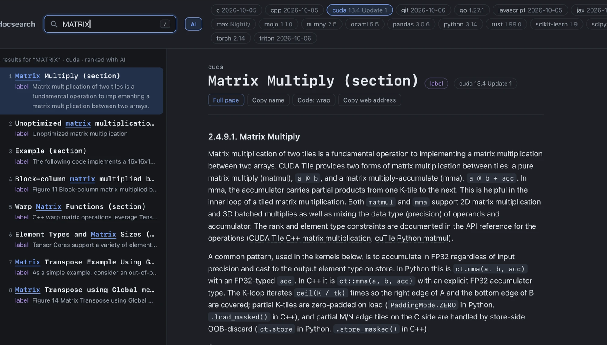

# docsearch

search docs from your terminal. read them in your browser. offline.

reading documentation is hard. it's spread over a dozen sites, each with its own layout,
its own search box, its own idea of where things go. you know the function exists, you
just can't remember what it's called or which page it's on.

sure, an llm can write the code for you. but sometimes you want to write it yourself and
just need to look things up fast. for a forgetful brain like mine. without leaving the
terminal.

so: type what you remember, get the official docs.

```bash
search np.sum                             # by name
search lnsvd                              # by a few letters
search dataframe.mrege                    # typos are fine
search sum of elements along an axis      # by meaning
search ai how do i drop duplicate rows    # a question, ranked by a small local model
```

your browser opens with results on the left and the docs on the right (safari on a mac).
that's it.



## what's in it

python packages (numpy, pandas, torch, scikit-learn, scipy, anything on pypi), plus
python, rust, c, c++, go, javascript, ocaml, cuda, mojo, max and git. add whatever else
you want.

everything runs on your computer. once the docs are downloaded, nothing goes online.

## install

paste one block in a terminal. it works out what your computer has: on a mac with apple
silicon the models run on the gpu, everywhere else on the processor. needs
[git](https://git-scm.com) and [uv](https://docs.astral.sh/uv/) (no uv yet? windows:
`winget install astral-sh.uv`, mac and linux: `curl -LsSf https://astral.sh/uv/install.sh | sh`,
then open a new terminal). uv also gets python 3.11+ if you don't have it.

### mac, linux and wsl

```bash
git clone https://github.com/ahmad-sardar/docsearch ~/docsearch && cd ~/docsearch
uv sync
.venv/bin/search setup        # downloads the models and the docs, once. takes a while.
rc=~/.$(basename "$SHELL")rc  # ~/.zshrc or ~/.bashrc
echo "alias search='$HOME/docsearch/.venv/bin/search'" >> $rc && source $rc
```

on wsl (linux inside windows) the results open in your windows browser. wsl and windows
are separate copies with their own docs and models, so install in the one you'll use.

### windows

in powershell:

```powershell
git clone https://github.com/ahmad-sardar/docsearch $HOME\docsearch
cd $HOME\docsearch
uv sync
.venv\Scripts\search setup       # puts search on your PATH, downloads the models and the docs. takes a while.
$env:Path = "$HOME\docsearch\bin;$env:Path"      # search in this window too (new ones have it)
```

want to pick your docs first (any system)? `search setup --no-docs` sets up the command and
the models only, then `search add numpy pandas`. setup stopped halfway? run it again: what's
already downloaded is checked and kept.

no gpu needed. on a mac with apple silicon the models run on the gpu, everywhere else on
the processor: same results (measured, see `eval/results-backends.md`), just slower.
`search ai` takes ~6.5 s instead of ~3 s on a fast processor, more on a slow one, and
computing the vectors in `search setup` and `search add` takes longer. plain search is
still instant. needs ~3 GB of memory with ai. no man pages on windows.

hugging face blocked on your network? `search setup` notices and gets the same model files
from this repo's [release](https://github.com/ahmad-sardar/docsearch/releases/tag/models-v1)
instead, checked against the same hashes. or copy `data/models` over from a computer that
has it.

your list of docs lives in `packages.toml`. edit it and run `search sync`.

## use

```bash
search numpy svd              # just numpy
search                        # open the page
search list                   # what you have, and which version
search stop                   # stop the background server
search --help                 # every command (search add --help: its options)
```

in the page:

| key | does |
|---|---|
| type | search |
| ↑ ↓ | pick a result |
| enter | open the full page |
| esc | back |
| / | jump to the search box |
| w | wrap long code lines |
| c | copy the name |
| ⌘↩ / ctrl+enter | rank this search with ai, once |

before you type anything, the list shows the docs in reading order, like a table of
contents.

### search tricks

- `"drop_duplicates"` in quotes: exact match only
- `/^numpy\.linalg\./` between slashes: regex on names
- `search -e drop_duplicates`: exact match from the terminal (the shell eats quotes)
- `search ai ...`: for questions and ideas. a small model on your computer reorders the
  top results. slower (~3 s on a mac), better for "how do i...". plain search is better
  for names.

## adding docs

```bash
search add polars                        # a pypi package
search add rust go                       # languages, see: search known
search add mydocs=https://docs.example.com/
search add mydocs=~/Downloads/docs.zip   # docs you downloaded yourself
search remove polars
```

## versions

```bash
search upgrade                 # everything to latest
search upgrade numpy           # one package
search downgrade numpy==1.26   # an older one
```

want two versions side by side? `numpy = ["latest", "1.26"]` in `packages.toml`.

## saving tutorials

found a good article? keep it.

```bash
search save https://realpython.com/python-f-strings/
search save https://docs.python.org/3/tutorial/classes.html --series   # and the next parts
search save URL --to rust-stuff                                        # your own folder
```

it keeps the article, drops the ads and menus, and makes it searchable with everything else.

## when downloads fail

it tells you why (site down, blocked, moved, needs javascript...) and what to try. your
existing docs are never touched until a new download fully works. if a site won't let
programs in, download the docs yourself and `search add name=/path/to/folder`.

## safe

- offline after setup. the search can't reach the internet even by accident.
- downloaded pages are stripped of scripts before you see them.
- models come from fixed versions and are checked by hash. no pickle files.

## how good is the search

measured, not guessed. see `eval/` if you care.

## license

MIT. use it however you like. (`eval/so_questions.json` has stack overflow titles, which
stay cc by-sa 4.0.)

## contributors

- [@ahmad-sardar](https://github.com/ahmad-sardar)
- claude (anthropic), co-author
